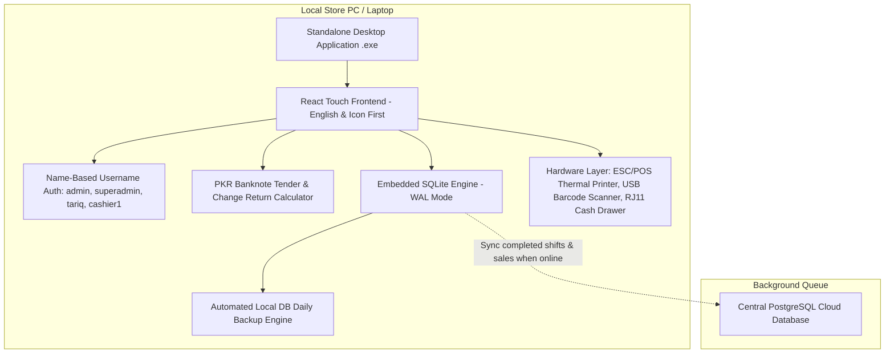
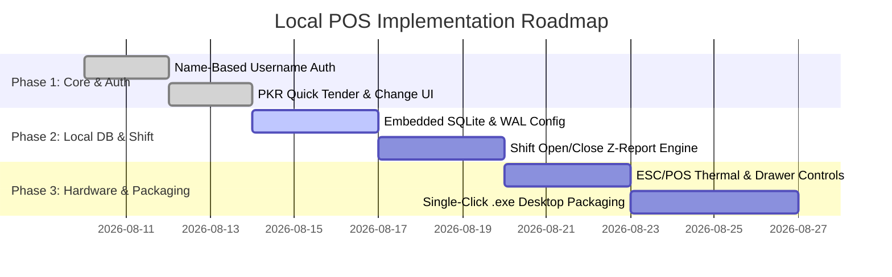

# Master Implementation Plan: Standalone Zero-Config Offline Local POS (Pakistani Retail Market)

## 1. Executive Summary & Product Owner Directives

This master plan consolidates all architectural solutions, database strategies, UI/UX designs, and user decisions agreed upon during our review:

1. **Target Market**: Pakistani retail stores (Kiryana, general stores, bakeries, fast food outlets).
2. **User Accessibility**: Non-technical cashiers and store owners requiring zero-configuration, simple 1-tap workflows, and icon-first English interfaces.
3. **Language Strategy**: **English-Only (Phase 1)** with high-contrast visual icons and clear color-coded buttons.
4. **Authentication Model**: **Name-Based Username Login** (`admin`, `superadmin`, `tariq`, `cashier1`, `cashier2`).
5. **Deployment Target**: Standalone single-click executable (`.exe` via Tauri/Electron) for Windows laptops/desktops running **100% offline**.
6. **Data Storage Engine**: Local **SQLite** with Write-Ahead Logging (WAL) enabled, resilient to load-shedding power loss, capable of indexing up to 1 Billion records with sub-2ms search latency.

---

## 2. System Architecture & Topology

---

## 3. Detailed Component Plan

### A. Authentication & User Management
- **Name-Based Login Fields**: Replaced email fields with simple name-based usernames.
- **Default Roles**:
  - `superadmin` / `admin` (Role: Admin / Back Office)
  - `tariq` / `manager` (Role: Store Manager)
  - `cashier1` / `cashier2` (Role: POS Cashier)

### B. Zero-Config Database Architecture & Product Catalog
- **Engine**: Embedded SQLite with Write-Ahead Logging (`journal_mode = WAL`).
- **Pragma Tuning**: Memory-mapped I/O (`mmap_size = 2GB`), page cache (`cache_size = -64000`).
- **Pre-populated Defaults**: Currency `PKR` (`Rs.`), Tax `0%`, zero complex setup screens.
- **Deals & Fast Food Items Catalog Support**:
  - **Single Items**: Burgers, Pizzas, Fries, Drinks, Wraps, Shawarmas, Bakery items.
  - **Combo Deals & Packages**: Special family deals, student combos, deal tags, discounted bundle pricing.
  - **Food Types & Categories**: Classified by Cuisine/Food Types (`Fast Food`, `Bakery`, `Beverages`, etc.).
- **Data Models**:
  - `essential_config`: Global store defaults.
  - `products` & `deals`: Barcode & Deal tag indexed ($O(\log N)$ search latency <1ms across 1M+ rows), name, price, stock, category.
  - `shift_sessions`: `opening_cash`, `total_sales_cash`, `total_sales_digital` (JazzCash/EasyPaisa), `total_sales_udhaar`, `actual_closing_cash`, `cash_variance`.
  - `transactions`: Local sale receipts with cash tendered and change calculations.
  - `customer_khata`: Udhaar credit ledger linked to customer phone numbers.

### C. Cashier Checkout & Change Calculator UI
- **Quick Tender Buttons**: 1-tap Pakistani Rupee note shortcuts (`Exact`, `Rs 100`, `Rs 500`, `Rs 1,000`, `Rs 5,000`).
- **Visual Change Return Banner**: Prominent green banner displaying **CHANGE RETURN TO CUSTOMER** with large rupee amounts.
- **Barcode & Audio**: USB scanner input auto-focuses on barcode scan with high-pitch success chime.

### D. Daily Shift Opening & Closing Workflow
- **Shift Opening**: Cashier enters starting drawer cash (e.g. Rs 2,000) and taps **Start Shift**.
- **Shift Closing**: Cashier enters physical counted cash, system auto-calculates Over/Short variance, updates shift status to `CLOSED`, and prints thermal Z-Report summary.

---

## 4. Implementation Phasing & Milestones

---

## 5. Verification & Test Criteria

1. **Build Integrity**: Clean `npm run build` with zero TypeScript compilation errors.
2. **Offline Resilience**: Simulated abrupt app kill/power cut leaves SQLite WAL database completely intact.
3. **High-Scale Performance**: Barcode lookup benchmark under 2ms for 500,000+ item database.
4. **UX Sanity**: Cashier login using `cashier1`, quick tender with `Rs 1,000`, and shift closure Z-report print.
