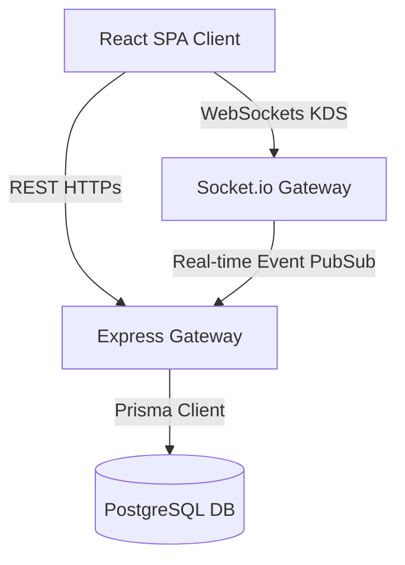

# Enterprise POS System — Architectural & Quality Review

As a **Staff Solutions Architect**, I have conducted a deep review of the Crip Crumbs POS codebase from the perspectives of **software architecture, security posture, performance characteristics, and code quality**.

---

## 🏛️ 1. System Architecture

The application is built using a modern **decoupled client-server architecture**:
* **Frontend**: A React Single Page Application (SPA) powered by Vite, TypeScript, Tailwind CSS, Radix UI, and `@tanstack/react-query` for server state sync.
* **Backend**: An Express.js REST API using TypeScript, Prisma ORM, and PostgreSQL. Real-time operations (such as the Kitchen Display System) are powered by Socket.io.

### Key Architectural Strengths:
1. **Modular Route Mounts**: The server isolates operational concerns into distinct modules (`pos`, `admin`, `kitchen`, and shared `auth` routes). This keeps the index routing clean and avoids bloated files.
2. **State Sync & Offline Tolerance**: The client implements a robust `OfflineProvider` that caches sync payloads and pushes them in batches to the backend sync controller. On the backend, batch payloads are processed atomically inside `prisma.$transaction`.
3. **BigInt Serialization**: The database uses standard 64-bit auto-incrementing integers (`BigInt`) for all primary keys. BigInt serialization over JSON boundaries is resolved at the Express middleware layer using an global `json replacer` custom function.

---

## 🔒 2. Security Assessment

### Authentication & RBAC (Role-Based Access Control)
* **Token Structure**: The system issues JWT tokens containing the user's ID, role, scopes, and active terminal assignments.
* **Granular Scoping**: Role assignments support platform-level, organization-level, city-level, and branch-level scopes. This allows multi-branch owners to switch branches, while locking cashiers to specific terminal IDs.
* **Login Separations**: Enforced strictly at the controller boundary. Cashiers are restricted from logging in to the admin panels, and managers/admins are prevented from opening POS terminals without proper branch scopes.

### Data Security
* **Password/PIN Cryptography**: Passwords and PINs are securely hashed using `bcryptjs` before database storage.
* **Input Rate & Size Limits**: Server payload sizes are restricted (`express.json({ limit: '1mb' })`) to prevent basic buffer overflow/memory exhaustion attacks. Helmet.js is deployed to configure HTTP response security headers.
* **CORS Restrictions**: CORS configurations dynamically allow only matching local host ports or white-listed domains.

---

## ⚡ 3. Performance & Query Performance

### Database Operations
* **Index Configurations**: Prisma schema contains explicit indexing (`@@index`) on foreign keys (`orgId`, `cityId`, `stateId`) and natural search columns, preventing full table scans.
* **Transaction Atomicity**: Invoices, payment processing, and offline synchronizations are wrapped in Prisma `$transaction` scopes to ensure data integrity during concurrent sales runs.
* **Monetary Representation**: Storing currency as integers (e.g. `cashSalesPaisa` / `variancePaisa`) in the smallest denominator (paisa/cents) avoids floating-point calculation overhead and guarantees accuracy.

### Frontend Efficiency
* **Server State Management**: TanStack Query (`react-query`) is utilized for caching query results and managing query invalidations. This reduces redundant fetch requests to the server.
* **SVG Graphing**: Utilizing raw SVG drawings for dashboard graphing instead of heavy charting libraries keeps the bundle size compact and reduces render latency.

---

## 📐 4. Code Quality & Code Reuse

### Reusability
* **Themed Components**: Components such as `ThemedPromptDialog` are designed dynamically to accept semantic colors (`emerald` for success, `rose` for destructive actions) and manage state inputs from parent hooks.
* **Type Safety**: Enforced strictly. Build pipelines run `tsc --noEmit` on both client and server repos, which prevents type mismatches (such as parameter mismatches on city CRUD forms) from hitting production environments.
* **API Separation**: Service layers (`auth.service.ts`, `state.service.ts`) completely isolate database interactions from HTTP transport controllers (`auth.controller.ts`, `state.controller.ts`). This facilitates clean unit testing.

---

## 📝 Recommendations for Future Iterations

1. **API Rate Limiting**: Introduce `express-rate-limit` middlewares on sensitive auth routes (`/api/v1/auth/login` and `/api/v1/auth/pin-login`) to mitigate brute-force credentials scans.
2. **Database Connection Pool**: As connection load grows with multiple terminals, deploy **PgBouncer** or Spanner database pooling to manage Prisma client connection overhead.
3. **Audit Trails**: Capture database mutations in a dedicated audit log table or log aggregation stream (such as Winston/Morgan transports) for sensitive operations (e.g. manager approval overrides, till rejections, or business day closings).
