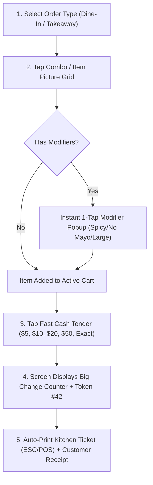

# Fast Food (QSR) Offline-First POS Architecture & UX Blueprint

## 1. Fast Food Operational Overview
Fast Food / Quick Service Restaurants (QSR) require extreme transaction speed (5-10 seconds per order), zero-friction item customization (combos/modifiers), kitchen routing (KDS/Thermal Printers), and high-contrast touch interfaces for fast-paced, non-technical cashiers.

---

## 2. Fast Food Specific Data Model (Combos, Modifiers & Kitchen Routing)

```sql
-- Fast Food Categories
CREATE TABLE categories (
    id TEXT PRIMARY KEY,
    name TEXT NOT NULL,
    color_code TEXT DEFAULT '#3B82F6', -- Visual color coding for fast touch navigation
    sort_order INTEGER DEFAULT 0,
    image_url TEXT
);

-- Fast Food Items (Burgers, Drinks, Sides, Deals)
CREATE TABLE products (
    id TEXT PRIMARY KEY,
    category_id TEXT REFERENCES categories(id),
    name TEXT NOT NULL,
    short_code TEXT, -- e.g. "ZB" for Zinger Burger, "C1" for Combo 1
    price REAL NOT NULL,
    is_combo INTEGER DEFAULT 0, -- 1 = Combo Meal
    kitchen_printer_target TEXT DEFAULT 'KITCHEN_1', -- KITCHEN_1, BEVERAGE_BAR, FRYER
    image_url TEXT,
    is_available INTEGER DEFAULT 1
);

-- Item Modifiers (Extra Cheese, No Onion, Spicy, Large Size)
CREATE TABLE modifiers (
    id TEXT PRIMARY KEY,
    group_name TEXT NOT NULL, -- e.g. "Spice Level", "Add-ons", "Remove Ingredients"
    name TEXT NOT NULL, -- e.g. "Extra Cheese", "No Mayo", "Large Fries Upgrade"
    price_delta REAL DEFAULT 0.00, -- e.g. +$0.50
    kitchen_tag TEXT -- e.g. "NO MAYO" printed in RED on kitchen ticket
);

-- Association between Products and Modifiers
CREATE TABLE product_modifiers (
    product_id TEXT REFERENCES products(id),
    modifier_id TEXT REFERENCES modifiers(id),
    PRIMARY KEY (product_id, modifier_id)
);

-- Fast Food Order Header
CREATE TABLE orders (
    id TEXT PRIMARY KEY, -- Offline Unique UUID
    token_number INTEGER NOT NULL, -- Daily resetting sequence: #01, #02, #03...
    order_type TEXT NOT NULL, -- DINE_IN, TAKEAWAY, DRIVE_THRU
    status TEXT DEFAULT 'COMPLETED', -- PENDING, KITCHEN_PREPARING, READY, SERVED
    total_amount REAL NOT NULL,
    tendered_amount REAL NOT NULL,
    change_amount REAL NOT NULL,
    payment_method TEXT NOT NULL, -- CASH, CARD, QR
    cashier_id TEXT,
    created_at TIMESTAMP DEFAULT CURRENT_TIMESTAMP,
    synced_to_cloud INTEGER DEFAULT 0
);

-- Order Items & Customizations
CREATE TABLE order_items (
    id TEXT PRIMARY KEY,
    order_id TEXT REFERENCES orders(id),
    product_id TEXT REFERENCES products(id),
    product_name TEXT NOT NULL,
    unit_price REAL NOT NULL,
    quantity INTEGER NOT NULL DEFAULT 1,
    modifiers_json TEXT -- JSON array of selected modifiers: [{"name":"Extra Cheese", "price":0.50}]
);
```

---

## 3. High-Speed Fast Food Order Workflow (5-Second Rush Hour Flow)



---

## 4. Kitchen Ticket Printing (Offline LAN / ESC/POS USB)

Fast food orders must instantly send kitchen tickets without relying on internet access.

### Kitchen Thermal Receipt Format
```text
========================================
           KITCHEN TICKET #42           
         ORDER TYPE: TAKEAWAY           
        TIME: 12:45 PM | POS-01         
========================================
[2x] ZINGER BURGER COMBO
     * NO MAYO (RED ALERT)
     * EXTRA CHEESE (+$0.50)
     * DRINK: PEPSI LARGE
----------------------------------------
[1x] LARGE FRIES
     * EXTRA KETCHUP
========================================
```

### Local Hardware Communications:
- **USB Thermal Printer / Network Thermal Printer**: Connected over local router LAN or USB port.
- **ESC/POS Binary Commands**: Direct raw socket or serial port write for lightning-fast printing (<1 second).

---

## 5. UI/UX Fast Food Touch Layout Strategy

1. **Category Tabs with Distinct Color Coding**:
   - 🔴 **BURGERS & WRAPS** (Red Tab)
   - 🟡 **COMBOS & DEALS** (Gold/Yellow Tab)
   - 🟢 **SIDES & FRIES** (Green Tab)
   - 🔵 **DRINKS & SHAKES** (Blue Tab)
   - 🟣 **DESSERTS** (Purple Tab)

2. **Quick Upsell Bar**:
   - One-tap button at bottom of cart: `+ MAKE IT A MEAL (+$2.50)`
   - Auto-adds Fries + Drink to selected burger.

3. **Kitchen Token Display**:
   - Large prominent order token number (e.g. `TOKEN #42`) on both Customer Receipt and Cashier Confirmation Screen.

4. **1-Tap Quick Tender Buttons**:
   - Preset currency buttons ($5, $10, $20, $50, $100, EXACT CASH).
