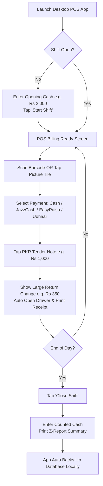

# Architectural Proposal: Zero-Config, Offline-First Local POS for Pakistani Retail Merchants

## 1. Executive Summary & Market Context

The local Pakistani retail ecosystem (Kiryana stores, fast food outlets, clothing shops, hardware stores, bakeries) is dominated by cashiers and business owners who require:
1. **Low Technical Barrier**: Non-technical staff, simple icon-first English interface, zero tolerance for complex setup screens or IT jargon.
2. **Local Machine Hardware**: Windows laptops/desktops running standalone applications offline, resilient to frequent power outages (load-shedding).
3. **Streamlined Operations**: Fast 1-tap shift opening/closing, clear cash drawer reconciliation, local currency (PKR) tendered cash calculators, and Udhaar (credit ledger) tracking.
4. **Language Scope**: **English Only (Phase 1)** with clean high-visibility icons and large visual touch targets (Urdu support deferred for future phases based on feedback).

---

## 2. Multi-Role Architectural Blueprint

### A. Senior Solution Architect & DevOps Principal Engineer
- **Topology**: Standalone Desktop Executable (Tauri / Electron wrapper with React + embedded SQLite database).
- **Zero-Dependency Installation**: Bundled as a single-click `.exe` installer for Windows. No requirement to install Node.js, PostgreSQL, Docker, or environment variables.
- **Data Storage Engine**: Local **SQLite** with Write-Ahead Logging (WAL) enabled.
  - Ultra-fast read/write response (<1 ms query latency).
  - Low memory footprint (<10 MB RAM for database engine).
- **Power Failure Resilience (Load-Shedding)**:
  - SQLite WAL mode ensures transactional ACID compliance and automatic recovery upon abrupt power loss.
  - Automated local DB snapshot on every shift closure to `C:\POS_Backups\` or attached USB drive.

---

### B. Database Administrator (DBA) & Data Architect
#### Minimalist Zero-Config Schema Architecture

```sql
-- 1. Essential Global Settings (Zero Config Required, pre-populated defaults)
CREATE TABLE essential_config (
    id INTEGER PRIMARY KEY DEFAULT 1,
    store_name TEXT DEFAULT 'My Store',
    store_phone TEXT DEFAULT '',
    currency_code TEXT DEFAULT 'PKR',
    currency_symbol TEXT DEFAULT 'Rs.',
    receipt_header TEXT DEFAULT 'Welcome to Store',
    receipt_footer TEXT DEFAULT 'Thank you! Please visit again.',
    tax_rate REAL DEFAULT 0.0
);

-- 2. Products (Icon/Picture & Barcode First)
CREATE TABLE products (
    id TEXT PRIMARY KEY,               -- UUID or auto-gen
    barcode TEXT UNIQUE,               -- Fast scan index
    name TEXT NOT NULL,                -- Product Name
    category TEXT DEFAULT 'General',
    sale_price REAL NOT NULL,
    cost_price REAL DEFAULT 0,         -- For profit calculation
    stock_quantity REAL DEFAULT 0,
    image_url TEXT,                    -- Local thumbnail path
    is_active BOOLEAN DEFAULT 1
);
CREATE INDEX idx_products_barcode ON products(barcode);
CREATE INDEX idx_products_name ON products(name);

-- 3. Simplified Shift & Till Management
CREATE TABLE shift_sessions (
    id TEXT PRIMARY KEY,               -- e.g. SHIFT-20260813-001
    cashier_name TEXT NOT NULL,
    opened_at TIMESTAMP DEFAULT CURRENT_TIMESTAMP,
    closed_at TIMESTAMP,
    opening_cash REAL NOT NULL DEFAULT 0,
    expected_cash REAL DEFAULT 0,
    actual_closing_cash REAL,
    cash_variance REAL DEFAULT 0,       -- (actual_closing_cash - expected_cash)
    total_sales_cash REAL DEFAULT 0,
    total_sales_digital REAL DEFAULT 0, -- JazzCash / EasyPaisa / Card
    total_sales_udhaar REAL DEFAULT 0,  -- Credit sales
    status TEXT DEFAULT 'OPEN',        -- 'OPEN' | 'CLOSED'
    notes TEXT
);

-- 4. Offline Sales Transactions
CREATE TABLE transactions (
    id TEXT PRIMARY KEY,               -- POS1-TIMESTAMP-SEQ
    shift_id TEXT REFERENCES shift_sessions(id),
    receipt_number TEXT UNIQUE,
    total_amount REAL NOT NULL,
    discount_amount REAL DEFAULT 0,
    net_payable REAL NOT NULL,
    payment_method TEXT NOT NULL,      -- 'CASH', 'JAZZCASH', 'EASYPAISA', 'CARD', 'UDHAAR'
    cash_tendered REAL DEFAULT 0,
    change_due REAL DEFAULT 0,
    customer_phone TEXT,               -- For SMS receipt / Udhaar Khata
    customer_name TEXT,
    created_at TIMESTAMP DEFAULT CURRENT_TIMESTAMP
);
CREATE INDEX idx_transactions_shift ON transactions(shift_id);
CREATE INDEX idx_transactions_created ON transactions(created_at);

-- 5. Udhaar / Customer Credit Ledger (Khata)
CREATE TABLE customer_khata (
    id TEXT PRIMARY KEY,
    customer_name TEXT NOT NULL,
    customer_phone TEXT UNIQUE NOT NULL,
    current_balance REAL DEFAULT 0,    -- Positive = customer owes store
    last_transaction_at TIMESTAMP
);
```

---

### C. Principal UI/UX Designer
#### Designing for Low-Literacy & Non-Technical Cashiers (English + Icon First)

1. **Clean English Text & High Visual Affordance**:
   - Primary action buttons feature **Large Icons + Bold English Text**.
   - Example: `Pay` [GREEN], `Shift Close` [ORANGE], `Clear` [RED].

2. **Pakistani Rupee (PKR) Quick Tender & Cash Return Visualizer**:
   - Cash payment screen offers quick tender buttons matching Pakistani banknotes:
     - `Exact Amount`
     - `Rs. 100` | `Rs. 500` | `Rs. 1,000` | `Rs. 5,000`
   - **Huge Visual Change Box**:
     - Large visual banner displaying **CHANGE DUE: Rs. 350**.

3. **1-Tap Picture & Barcode Grid**:
   - Grid layout with large product photos and price tags.
   - Barcode scanning triggers immediate high-pitch audio chime ("Beep") for successful scan.

4. **Khata (Udhaar / Credit) Ledger**:
   - Single tap to record an Udhaar transaction by inputting customer phone number or selecting from frequent customer list.

---

### D. Pro Level POS Developer & API Architect
#### Local Device Hardware Integrations

- **Thermal Receipt Printer (ESC/POS)**: Direct driverless thermal printing over USB / Serial / ESC-POS standard (58mm or 80mm paper). Auto-prints receipts upon sale completion.
- **Barcode Reader**: Plug-and-play USB scanner using standard HID Keyboard Emulation mode.
- **Cash Drawer**: Auto-opens drawer via RJ11 pulse output from printer upon completing a cash sale or clicking "Open Drawer".

---

### E. Financial & Compliance Specialist & Security Specialist
- **Simplified Daily Shift Reconciliation**:
  - Cashier enters starting cash at shift start.
  - At end of day, system auto-calculates total sales by type (Cash, JazzCash, EasyPaisa, Card, Udhaar).
  - Cashier enters physical cash counted in drawer.
  - System prints a simple **Z-Report** receipt showing: Total Sales, Net Profit, and Cash Shortage/Excess.
- **Data Protection**:
  - Local database file encryption using SQLCipher (AES-256) to prevent unauthorized access or tampering.

---

## 3. Streamlined User Journey (Day-in-the-Life)



---

## 4. Summary Recommendation & Next Steps

1. **Architecture Choice**: **Tauri + React + Embedded SQLite**.
2. **Key Differentiators for Pakistan Market**:
   - Zero-configuration standalone `.exe`.
   - English language with high-contrast icons.
   - Built-in PKR tender note calculator & big cash return display.
   - Built-in Udhaar Khata ledger.
   - 100% offline operation with load-shedding resilient database.
